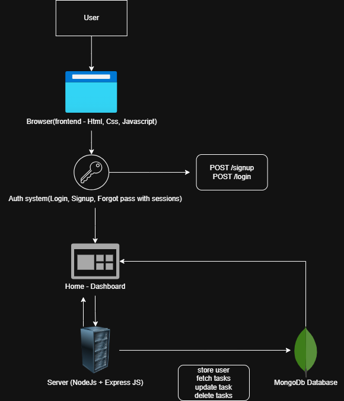

# **Task-Manager**
A web application using html, css, js as frontend and node, express, mongodb as backend to keep track of all the daily and essential tasks and where users can add new tasks, update the existing tasks, delete the tasks and so on..

## 🧠 System Design

